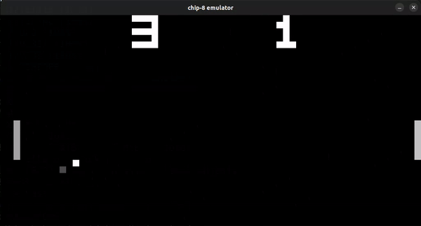

# Chip-8 Rust emulator

Yet another [Chip-8](https://en.m.wikipedia.org/wiki/CHIP-8) emulator written in Rust, marking the third step of my _Rust auditor_ journey. This project is following the previous [PngMe](https://github.com/Emskiq/pngme/tree/main) project, which actually suggested doing this emulator.



I would say this project is perfect for you, *if you have previous experience with programming*. [Laurence Muller](https://multigesture.net/about/) couldn't summurize it better in his [blogpost](https://multigesture.net/articles/how-to-write-an-emulator-chip-8-interpreter/)<br>
- Don’t use this project as a way to learn how to program. (If bitwise operations confuse you, study them first)

# Overview
This project is ideal for anyone who is already familiar with Rust and programming in general. I would compare its complexity to that of creating a small website using a framework like Django.

It comes highly recommended by the creator of the PngMe project, which (in my opinion) is _nearly perfect_ intermediate Rust project. However, unlike PngMe, this project lacks straightforward instructions and unit tests.

You can still test your implementation though and **I highly recommend doing it**. [These testsuites](https://github.com/Timendus/chip8-test-suite) are part of an excellent repository that will guide you with finalizing your code and finding any missed bugs.

The project delves into various topics in Rust and programming, including:
- Understanding the overall operation of a processor with ROM and a set of opcodes
- Handling graphics and user inputs
- Managing graphics, audio, and frame updates
- Working with memory stacks

### Overall score: 8 - 8.5

# Setup
### Prerequisites
- Linux OS, as the project has been developed on Ubuntu.
- [SDL2](https://en.wikipedia.org/wiki/Simple_DirectMedia_Layer) installed
- Rust installed (obviously 😁)

### Instalation steps
0. Clone the repository and install SDL
   
    ```bash
    sudo apt-get install libsdl2-dev
    ```

1. Build it locally

    ```bash
    cargo build
    ```
2. Run it
    ```bash
   ./target/debug/chip-8 [OPTIONS] <PROGRAM_FILE>
    ```

_You can set the scale in the options by typing `-s 16` e.g._

# Implementation

There are plenty of resources available that provide excellent pseudo code, which can guide you through completing the emulator. In this section, I'll provide a general overview of the main processes that occur behind the scenes while the emulator is functioning, along with sharing insights, resources, and problems I've encountered during development.

I highly recommend checking out these two excellent resources that essentially provide pseudo-code for implementing the emulator:
- [C/C++ emulator with pseudo code and logic](https://multigesture.net/articles/how-to-write-an-emulator-chip-8-interpreter/)
- [Rust emulator with pseudo code and logic](https://dhole.github.io/post/chip8_emu_1/)

## My Main Takeaways:

- ### Game Loop/Cycle

Initially, I implemented the basic game cycle/loop without considering factors such as framerate. While this approach may suffice for getting started, it's crucial to keep in mind that testing may reveal issues with the main processor cycle. Consider adding intentional delays/overtime to regulate the emulator's processing speed
(_Check the while loop in the main function_)
```rust
pub fn cycle(&mut self, key: u16) -> Result<()> {
  // store pressed key
  self.keypad = key;

  // update timers

  // --- Execution of an instruction in a FRAME
  self.time += FRAME_TIME;
  while self.time > 0 {
      // get/fetch instruction
      // decode operation code of instruction
      // execute instruction + get overtime that it takes to be executed originally
      //  --> This function can return overtime that will slow down the emulator
  }
  Ok(())
}
```

- ### Memory handling and Opcode decoding/exection

Personally, this part was fairly easy for me. However, it was also the one that led to bugs persisting until the end of development, mainly due to incorrect execution of the decoded opcodes.

Ensure that you properly load the chipset into memory and thoroughly check the implementation of opcodes to avoid such issues.

What can help you here are the [testsuites](https://github.com/Timendus/chip8-test-suite) mentioned above.

```rust
pub fn new(program: PathBuf) -> Result<Self, LoadInMemoryError>  {
  let mut emulator = Chip8{..Default::default()};

  emulator.load_font_set_in_memory();
  emulator.load_program_in_memory(program)?;

  Ok(emulator)
}
```

- ### Keyboard

- ### Graphics


# Resources and possibly some guidance 


